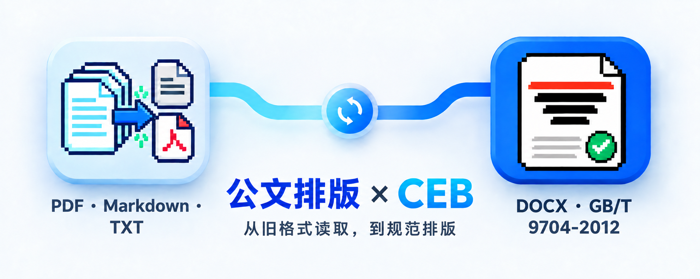
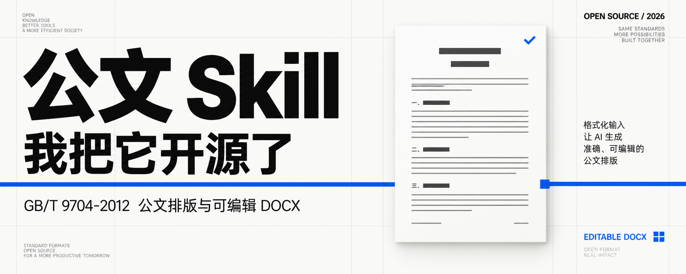

# Gongwen GB/T 9704-2012 Skill

> **信息安全提醒（请先阅读）**
> 本 Skill 用于文件转换与公文排版，不会替你判断文件是否可以公开。请勿把企业内部、涉密、敏感、受限或明确禁止对外的文件，上传到未获授权的在线模型、第三方服务或公共仓库。使用前，请按所在单位的信息安全、数据分类分级、保密和授权要求，确认文件可以进入当前处理环境；必要时先完成脱敏。若已在本地或企业内网部署大模型，可将本 Skill 部署在内部环境使用，并由使用单位自行落实访问控制、存储、日志、传输和输出文件管理。



> **配套工具：** [CEB 文件转换](https://github.com/mizzlelover/CEB) 负责把已验证的 Founder CEB 文件转换为 PDF、Markdown、TXT；[公文排版](https://github.com/mizzlelover/gongwen-gbt9704-skill) 负责把中文正式材料整理成符合 GB/T 9704-2012 的可编辑 DOCX。两个 Skill 可以连成一条“读取 → 整理 → 交付”的工作流。

把中文正式材料整理成可直接交付的公文 DOCX：按 GB/T 9704-2012 处理版心、字体、标题层级、文号、页码、附件与版记；普通稿不误用红头，正式发文支持预印红头纸套打或完整电子红头，并保留 Word/WPS 可更新目录。

## 为什么需要它

许多 AI 只会把标题设为黑体、正文设为仿宋，便把输出称为“公文”。本项目把 A4、版心、正文、层次、首页和页码等版式参数做成可生成、可检查的 DOCX 输出，并接受用户提供的机构名称、文号、署名、日期和页码模式。

## 项目缘起



### 我把自己常用的公文排版 Skill 开源了

我最早注意到 Skill，是 Claude Code 推出这个概念的时候。那时官方有一套 Office 相关的能力，用起来的第一感觉很好。以前让 AI 写完一份材料，常常还要把内容转成 Python，再自己补一段脚本去生成 Word。现在至少有了一个入口，生成的样式会比裸写一段提示词规整得多。


后来真正拿来干活，事情没有这么简单。

它能把 Word 读进去，也能再转回 Word，可原文件里那些我在意的格式经常留不住。标题层级、段前段后、缩进和页脚，拿到新文件里还得重新排。对不少国内企业来说，这已经够麻烦了。

还是得自己调。

事业单位和国企的正式材料更严，差几毫米、少一个页码规则，文件就很难往下走。

我开始自己调版式，才发现这些细节比想象中散。WPS 和 Office Word 看着能互相打开，字体命名却不总在同一套规则里。有的环境认中文字体名，有的认英文名。一个文件在电脑上排得好好的，换个环境，字号、行距和换行都有可能变样。


总有一处露馅。

后来 Kimi 推出客户端，我有一次把材料交给它，没特地交代公文格式。它自己去检索相关国标，顺手拼出了一份接近标准的版式。字体处理得不错，效果也比我预期好。我猜它读到了我原先 Kimi 环境里灵魂文件中的要求，但这只是我对当时行为的判断。


那次结果让我意识到，公文格式这件事确实适合做成 Skill。很多重复动作可以交给工具，用户也不必每次从页边距和字体名称重新讲起。

不过接着用下来，问题还是陆续冒出来。缩进、边距、段间距和页码，往往各自看着差不多，合到一份文件里就不够准。市场上可能早就有人做过公文 Skill，我自己做项目时顺手让 AI 生成了这一套，也一直没有专门去装别人的。

用得越多，我越不想靠“看起来像”过关。前些天我把 GB/T 9704-2012 逐项拿出来核了一遍，也把发现的问题逐个补进了 Skill。现在它会把常用的页面、字体、标题、正文、层级、机构名称、文号、署名、日期和页码排进可编辑的 DOCX，方便在 Word 或 WPS 里继续处理表格、附件和盖章位置。

我把这套 Skill 开源，是想让它从我自己的电脑里走出来。它现在可以安装到 Codex、Claude Code、OpenCode、Trae Code、Kimi、TraeWork、WorkBuddy 和 ZCode。各个平台读的是同一份规则，后续修改也不用在七八个目录里反复补。


它很小，却是我的刚需。很多时候，一份材料能不能顺利交出去，卡的就是这些平时没人愿意盯的细节。

如果你也在做中文正式材料，欢迎试试看。遇到问题可以直接反馈给我，我会继续把它改得更稳。

项目地址

https://github.com/mizzlelover/gongwen-gbt9704-skill

标准依据

https://std.samr.gov.cn/gb/search/gbDetailed?id=lOIe27f77QU%3D&mode=p

## 2.0 重大更新

2.0 重新核验了红头场景、首页预留、红线下标题间距、Word/WPS 标题样式、目录引用、特殊格式和跨平台安装，并完成 18 份 DOCX、37 个 PNG 页面和版头坐标量测。完整的更新说明见[2.0 重大更新文章](marketing/x-major-update.md)；文章、4 张新版插图和实际验证截图的合稿预览见[2.0 图文排版预览](marketing/x-major-update-layout-preview.md)。上一版记录仍保留在[红头规则更新说明](marketing/x-v2-release.md)。

公众号发布可直接使用[2.0 公众号 HTML](marketing/wechat-gongwen-2.0.html)：在浏览器打开后全选复制，再粘贴到公众号编辑器。

## 作者与同名内容 IP

这个项目由“谁是专家”持续维护。相关内容会记录 AI 工具、公文排版、正式材料和实际使用中的问题，欢迎从下面的入口找到我。

- 小红书：[谁是专家](https://www.xiaohongshu.com/user/profile/64dd6c680000000001011d25)
- X：[谁是专家](https://x.com/dboy_yi2025)
- 微信公众号：微信搜一搜“谁是专家”


## 关键词

`公文排版` `GB/T 9704-2012` `DOCX` `Word` `WPS` `Claude Code` `OpenCode` `Kimi` `Trae Code` `TraeWork` `WorkBuddy` `ZCode` `AI Skill` `中文正式材料`

## 能力与边界

| 场景 | 本项目的处理方式 |
| --- | --- |
| 文档主体 | A4、版心、标题、正文、层次、署名和日期排版 |
| 普通报告、方案、汇报 | 默认 `ordinary`，不因机构名称自动使用红头 |
| 正式发文与红头纸 | 显式 `formal`；默认预印红头纸套打，首面留白、不重绘红色机关标志和红线 |
| 完整电子红头 | 显式 `formal --letterhead digital`，才在 DOCX 中绘制红头要素 |
| 机构名称与文号 | 使用 `--org`、`--doc-no` 按对应版式定位；正式版式会拒绝明显不符合年份、六角括号、顺序号和“号”规则的文号 |
| 标题与目录 | 四级标题写入 Word/WPS 标题样式及大纲级别，可插入自动目录 |
| 页码 | 居中、单双页或不显示 |
| 印章、签名章 | 在生成的 DOCX 中按实际需要插入图片或完成实体盖章 |
| 特定格式 | `letter`、`command`、`minutes`、`horizontal-table` 使用对应生成分支；联合行文用 `--joint-org`，分离装订附件用 `--attachment-detached` |

GB/T 9704-2012 当前为现行标准，2025-05-30 复审继续有效。标准适用于党政机关制发公文，其他机关和单位可以参照执行。[全国标准信息公共服务平台](https://std.samr.gov.cn/gb/search/gbDetailed?id=lOIe27f77QU%3D&mode=p)

## 快速开始

```bash
node scripts/generate_gongwen_docx.mjs --input tests/fixture.md --output /tmp/gongwen.docx --format ordinary --title "公文格式回归测试"
node scripts/verify_gongwen_docx.mjs --input /tmp/gongwen.docx --profile ordinary
```

需要正式发文时，必须明确选择版式。下面的命令生成预印红头纸套打稿；首页只留出纸上已有红头和红线区域，DOCX 不会重绘它们。`--letterhead-reserve-mm` 表示纸张上边缘到预印机关标志区域起点的高度，生成器随后保留两行 28 磅版心空行再排变量文号，标题前再保留红线下两行空行。`72` 是默认值，应按本单位实际红头纸改为 `37—130` 毫米。

```bash
node scripts/generate_gongwen_docx.mjs --input tests/fixture.md --output /tmp/formal.docx --format formal --letterhead preprinted --letterhead-reserve-mm 72 --org "示例单位文件" --doc-no "示例发〔2026〕1号" --title "公文格式回归测试"
node scripts/verify_gongwen_docx.mjs --input /tmp/formal.docx --profile formal --letterhead preprinted
```

只有需要完整电子红头文件时，才加 `--letterhead digital`。红头和标题要使用目标电脑中实际安装的小标宋体；生成器缺少小标宋体或仿宋体时会在终端明确警告并写出替代字体，要求严格阻止替代输出时加 `--require-standard-fonts`。红线下标题会写入两个显式的28磅版心空行，不会依赖渲染器自行解释段前距；发文机关标志到文号也按相同方式留出两行。上行文的文号和签发人会在同一行编排。打开文档后，Word/WPS 的“引用→目录”可以按“标题1—标题4”生成并更新目录；是否显示第四级，在目录设置中选择。

信函、命令（令）、纪要和横排表格走专用分支：信函生成170mm上粗下细、下页边20mm处上细下粗的两条红色双线，底线放在页脚并关闭页码；命令（令）落实机关标志距版心上边缘20mm、令号下空二行、正文下空二行；纪要把“出席”“请假”“列席”标签设为黑体、人员名单设为仿宋，并放在正文或附件说明下一行；横排表格生成横向A4和225mm表格，单双页表头方向仍需目标Word/WPS模板核对。联合行文可重复传入 `--joint-org`，生成主办机关在前、联署机关名称分行排列；输入含“文件”时将“文件”置右并上下居中的标志；不能与正文一起装订的附件加 `--attachment-detached` 会在首行补排文号和附件序号。附件可用重复的 `--attachment-file` 另页生成“附件”标签、第三行标题和正文，并保持正式页码连续。带抄送或印发信息时，版记浮动锚定在最后一页版心底部，首末粗线约0.35mm、中间细线约0.25mm。

## 跨平台安装

本项目使用开放的 `SKILL.md` 目录结构，可在 Codex、Claude Code、OpenCode、Trae Code、Trae CLI、Kimi Code CLI、Kimi Code、TraeWork、WorkBuddy 和 ZCode 使用。

macOS / Linux：

```bash
scripts/install.sh --all
```

Windows：

```powershell
.\scripts\install.ps1 -All
```

安装器将同一份源目录链接到各平台的用户级技能目录；Windows 默认复制以避免符号链接权限问题。TraeWork 使用可导入包 [`dist/traework-gongwen-skill.zip`](dist/traework-gongwen-skill.zip)。完整目录、验证方法和官方依据见[跨平台安装说明](docs/platform-support.md)。

腾讯 WorkBuddy 开放平台上传使用 [`dist/workbuddy-gongwen-skill-v2.0.0.zip`](dist/workbuddy-gongwen-skill-v2.0.0.zip)。该包在 ZIP 根目录直接提供 `SKILL.md`，资源使用一级 `scripts/`、`references/` 和 `assets/` 目录，当前大小约 1.2 MB，低于平台 3 MB 限制。

## 项目内容

- [SKILL.md](SKILL.md)：使用指引与版式参数。
- [标准执行摘要](references/gbt9704-2012-summary.md)：国家标准的可执行要点。
- [逐条执行矩阵](references/gbt9704-audit-matrix.md)：按条款记录自动生成、结构校验和必须人工复核的边界。
- [正式公文核验表](references/formal-checklist.md)：模板完成后的全要素检查。
- [生成器](scripts/generate_gongwen_docx.mjs)：根据输入生成 DOCX 版式。
- [校验器](scripts/verify_gongwen_docx.mjs)：检查生成器可承诺的 DOCX 版式要素。
- [回归测试](tests/run_tests.sh)：运行居中与单双页页码生成、DOCX 包结构与 PDF 转换验证。
- [全条款视觉核验](references/gbt9704-visual-audit.md)：实际生成 18 份 DOCX、37 个 PDF 页面和 PNG，并逐条记录截图证据与人工边界。
- [全条款截图证据矩阵](references/gbt9704-screenshot-evidence.md)：把 GB/T 9704-2012 每个条款绑定到实际截图，明确哪些项目截图不能证明。
- [版头坐标量测](tests/measure-header-coordinates.mjs)：用 PDF 字形坐标独立核对份号首行、机关标志 35 mm 定位及可选字段不移位。
- [跨平台安装测试](tests/test-install.sh)：隔离环境中验证九个本地目录和 TraeWork 导入包。

## 验证

```bash
tests/run_tests.sh
# 需要截图核对时，再运行完整视觉审计
bash tests/visual-audit.sh /tmp/gongwen-visual-audit
```

如果要把字体替代也视为失败，可在生成器和校验器上同时加 `--require-standard-fonts`；当前电脑没有小标宋体或标准仿宋体时，命令会停止并明确列出缺失字体。

这项测试证明生成器、校验器和可打印文件链路可运行。视觉审计会把每个场景转成 PDF 和 PNG，按截图检查版头、标题间距、首页正文、单双页页码、附件和版记。最终文件仍须按实际用途在目标 Word/WPS 与打印条件中检查。

## 许可

MIT。标准文本及机关模板应按各自权利和管理规则取得与使用。
