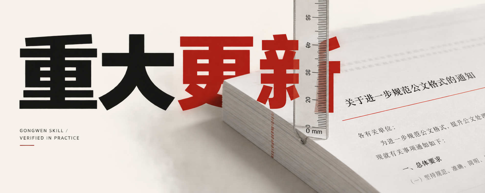
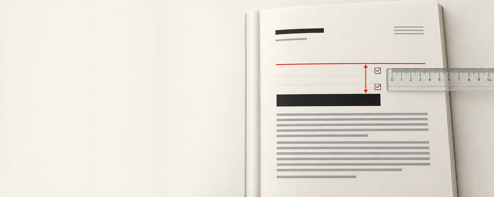
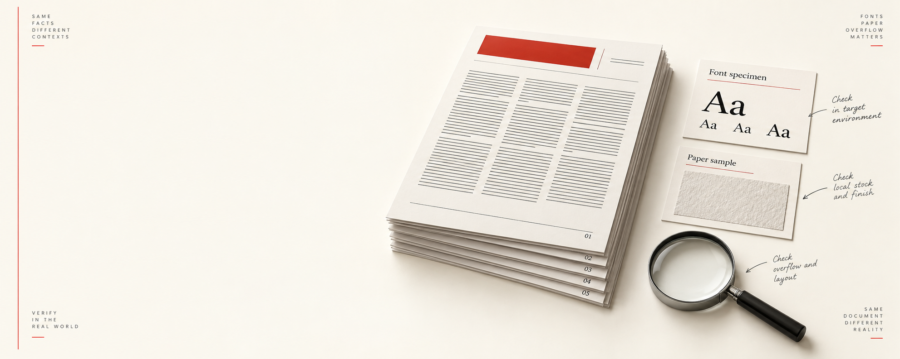

# 从能生成到敢把截图摆出来，Gongwen Skill 这次算重做

上一篇文章发出去以后，我本来只想继续把几个小问题补上。

动手后，我发现这个判断太轻了。

这次更新的起点，是我刚好触发了上一版的红头文件规则。过去我处理红头材料，有一个自己已经用习惯的办法。正文排好以后，在首页上方手动留出空白，再把预印好的红头纸放进打印机。纸上已经有机关标志和红线，电脑只负责把黑色内容打到下面。

这个办法不漂亮，却很清楚。

上一版 Skill 走了另一条路。它在文档里画出了电子机关抬头和红色分隔线，红线和标题的距离还贴得很近。我看到那张页面截图，先停下来问自己，之前到底核对了什么。调一个间距参数，已经解释不了这个问题。

## 红头文件先把场景说清楚

公文里的“红头”不是普通材料的默认装饰。

普通报告、方案、汇报材料，正文里出现单位名称，不代表它们就要自动进入红头版式。正式发文时，才需要选择正式公文分支。正式公文又分两种情况。

一种是把电脑文件打到已经印好红头和红线的纸上。这个场景下，首页要给纸上的内容让出区域，DOCX 不应再画一套电子红头。

另一种是确实要交付完整的电子红头文件。只有显式选择这个场景时，文档才生成电子机关标志和红线。

现在这两个分支已经拆开。预印纸套打默认保留首页上方区域，电子红头单独生成。红线下的标题也不再只靠段前距，而是写入两个明确的 28 磅空段落。渲染器没有理由把它压回红线边上。

这正是我在上一版里没有认真守住的地方。

## 我把标准条款重新放回页面

GB/T 9704-2012 现在仍是现行标准。状态页在 2025 年 5 月 30 日的复审结论是继续有效。我把版头、主体、版记、页码、附件、信函、命令和纪要这些部分重新按条款对照，再回到生成器、校验器和渲染结果里看。

单看 XML 属性远远不够。

这次实际跑了 18 份 DOCX，转成 18 份 PDF，再输出 37 个 PNG 页面逐张看。电子红头首页还单独做了字形坐标量测，带版头字段和不带字段的机关标志位置差是 0.00 mm。这个数字只能说明这批样本里的定位稳定，不能替代目标单位的模板和印刷检查，但至少我终于有了一条可以复查的证据链。

实际页面里能看到几个以前容易被一句“格式正确”带过的细节。

普通材料不会因为传入机构名称就自动变成红头。预印红头场景不会重复绘制红色内容。联合行文的主办机关和联署机关按不同位置排列。上行文的文号和签发人保持在同一行。附件另页后，页码继续连排。长文末页的版记贴住版心底部。信函、命令和纪要各自走自己的格式分支，不能拿普通公文的规则硬套。

横排表格还保留着一个诚实的缺口。横向页面和表格尺寸已经能生成，单双页表头朝向仍要在目标 Word 或 WPS 模板中处理。我把它明确写进证据矩阵里，没有把“页面横过来了”写成“第八条全部完成”。

## 标题好看还不够，结构也要能被引用

上一版多级标题的字体和字号已经比较像了，文件却没有真正导入标题样式。

这会带来一个很实际的问题。打开 Word 或 WPS，标题看着有层级，引用功能却找不到它们，目录也不能按章节自动生成。后续有人增删一节，目录还得手工重做。

这次标题一到标题四都写入了对应的标题样式和大纲级别。文档的层级不再只存在于字面大小里，Word 和 WPS 可以按标题结构生成、更新和跳转目录。

## 跑过这一轮以后，才知道哪些话不能说满

这次验证也把边界照得更清楚。

当前机器没有方正小标宋和标准仿宋字体。生成器会点名提示，并使用替代字体完成结构和分页检查。加上 `--require-standard-fonts` 后，它会直接停止输出。替代字体能帮助我发现段落、分页和位置问题，却不能被包装成已经达到最终印刷字体标准的成品。

纸张克重、白度、耐折度、不透明度、pH 值、红黑油墨、双面套正、裁切、装订和印章，也不可能靠一张屏幕截图完成验收。长标题、复杂联合行文、目标单位专用模板和部分溢出问题，还要回到实际 Word、WPS 和打印条件里继续看。

我现在更愿意把这套 Skill 说成一个已经认真重做、经过真实样本验证、同时保留现场边界的工具。

## 这次更新到底重在哪里

第一版解决的是“能不能生成一份像公文的 Word”。

这次解决的是“能不能把场景分开，把条款落到结构里，再把生成结果拿出来逐页核对”。

这两个问题看起来只差几句话，工作量完全不是一个级别。红头规则、留白、版头坐标、标题样式、目录引用、附件、版记、特殊格式和跨平台安装，任何一项没有落到文件里，最后都可能在打印前露出来。

我也把安装测试重新跑了一遍。Codex、Claude Code、OpenCode、Trae Code、Kimi、TraeWork、WorkBuddy 和 ZCode 使用的是同一份技能源目录，TraeWork 另有可导入包。平台可以不同，规则不再各写一份。

所以这次我不太想用“又迭代了一版”来描述它。

相比第一版，它更像是把生成方式、核验方式和我自己对“完成”的判断一起重做了一遍。说它脱胎换骨，有点夸张，但至少已经不是在旧页面上补几个参数。

如果你正好要做中文正式材料，可以从 GitHub 取下来试试。遇到字体、纸张、目录、溢出、Word/WPS 换行或套打偏移，最好把实际页面截图和使用环境一起反馈回来。公文版式很多问题只有落到具体机器、具体字体和具体纸张上，才会真正出现。

项目地址

https://github.com/mizzlelover/gongwen-gbt9704-skill

标准状态

https://std.samr.gov.cn/gb/search/gbDetailed?id=lOIe27f77QU%3D&mode=p

完整截图证据

https://github.com/mizzlelover/gongwen-gbt9704-skill/tree/main/references/assets/visual-audit/all-rules

#公文排版 #GongwenSkill #GBT9704 #Word #WPS #ClaudeCode #Kimi #AI工具
