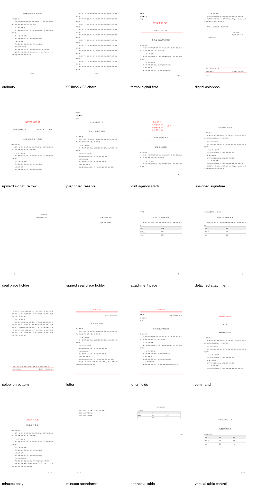
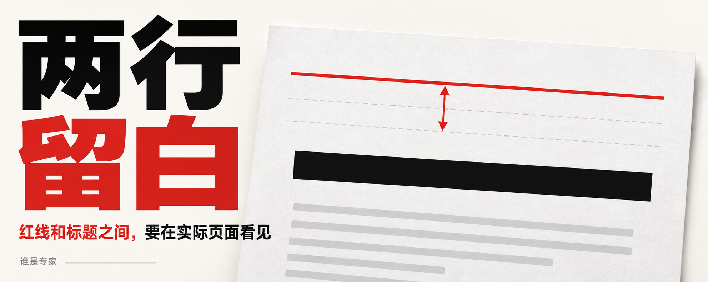
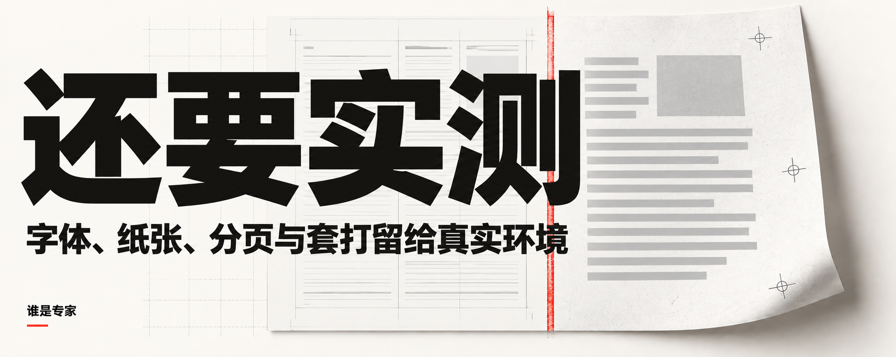

# 一条贴着标题的红线，让我把公文 Skill 重做了一遍

> Gongwen Skill 2.0 重大更新

上一篇刚把 Gongwen Skill 介绍出去，我自己用着用着，又发现了问题。

这次出问题的是红头。

打开生成的文件，机关名称是红的，分隔线也有，可下面的标题几乎贴在线上。再看抬头的字体，也不对。

做公文的人应该能理解这种感觉。内容还没开始读，光看首页，就知道这份文件还得改。

我得先把一件事交代清楚。

上一版的红头模式，我自己没有完整实测过。此前我的习惯是先把正文排好，手动换行，在首页上方留出空白，再用单位已经印好红头的纸打印。机关名称和红线都在纸上，电脑里的文件留好位置就行。

我一直用自己的办法处理这一段，也就一直没碰到 Skill 里的这条分支。

直到这次触发，它直接在文档里生成了电子抬头和红线，连间距问题一起暴露出来。

一个自己天天在用的工具，也可能藏着一段自己从没认真用过的功能。发布时，我对它的把握显然超过了实际验证的范围。

最初做这个 Skill，只是想少花一点时间调 Word。

我经常要处理正式材料，字体、缩进、页边距、页码，每份都从头交代一遍实在麻烦。好不容易在一台电脑上排顺了，换到 WPS 或另一台装着不同字体的电脑，又可能变样。

所以我把常用规则做进 Skill，慢慢补，自己也一直用。

但红头这一页让我开始怀疑，之前那些“已经核对过”的地方，到底核到了哪一步。

规则写进说明了吗？生成的文件用上了吗？打开以后，页面上的效果还对吗？

这几件事之间，确实隔着不少工作。

于是这次，我把 GB/T 9704-2012 又拿出来，逐条对照生成器和校验器，再去看最终页面。查到哪里，就拿对应的场景生成一份文件。普通材料之外，上行文、联合行文、附件、信函、命令、纪要，也都要各自跑到。

最后这一批生成了 **18 份 Word 文件，转换成 18 份 PDF，共 37 页**。

下面是仓库里保留的实际渲染总览。它们用于核对版式，当前环境仍有字体替代，不能当作标准字体的印刷样张。

这一轮里，有些错误看起来很小，原因却藏得很深。

比如左上角加上份号、密级和紧急程度以后，机关标志会被下面的段落一起往下推。字段都在，顺序也对，整页的位置已经变了。

修完后，又专门量了一次 PDF 里的字形坐标。这批样本中，有这些字段和没有这些字段，机关标志的位置差是 0.00 毫米。至少这次，补几个字段不会再把抬头挤走。

还有那条贴着标题的红线。原先设置了段前距离，最终渲染却没有按预期留出来。现在改成明确的空行结构，再看渲染后的页面，确认间距确实出现。

我对这种问题印象特别深。代码里明明写着，纸面上偏偏没有。只让 AI 再读一次代码，很容易又得到一句“已符合要求”。

红头的使用场景也重新拆开了。

普通方案、报告和汇报材料，默认按普通材料排。出现单位名称，不会自动加红头。

需要正式发文时，再选择对应格式。如果用预印红头纸套打，文档给纸上的红头区域留白，具体位置按实际纸样核对。需要完整电子红头文件，就明确选电子红头模式。

这两种使用方式，现在有各自的处理规则。

另外一个补上的地方，是标题样式。

以前多级标题已经有了不同字体和字号，可 Word 并不知道这些段落是标题。等你想插入目录，才发现前面排得再像，引用功能也找不到文章结构。

这对长方案尤其烦。章节改了，目录还得跟着手改。

现在标题一到标题四都写入了对应样式和大纲级别，可以供 Word、WPS 的目录功能引用。具体文件打开后，仍要更新目录、核对分页，但至少不用再从正文里把标题一个个重新挑出来。

附件、末页版记、单双页页码，以及几种特殊公文格式，这次也补查了不少地方。相关条款、实际截图和仍需人工处理的项目，都放进了仓库，方便以后接着核。

做到这里，我才觉得，这次可以叫重大更新。

第一版到现在，改动已经远远超过了我最初想补的那几个小问题。连验证的方法都换了一遍。对我个人来说，确实有种脱胎换骨的感觉。

不过，剩下的问题也要一起讲。

这轮验证用的机器缺少所需的小标宋、仿宋字体，部分页面使用了替代字体。现在工具会明确提示缺什么、换成了什么，也提供严格模式，缺字体就停止生成。字号相同，字体换了，字宽和换行仍可能跟着变，这一点躲不开。

纸张和实际打印也还有工作。预印纸的位置、打印缩放、双面套正、装订，都得拿纸样检查。长标题、复杂表格和部分溢出情况，还没有全部解决。横排表格的单双页表头朝向，目前也需要在目标 Word 或 WPS 模板里处理。

这些都是后续要继续做的具体事情。

跨平台的安装检查也重新跑过了。Claude Code、OpenCode、Trae Code、Kimi、TraeWork、WorkBuddy、ZCode，以及我自己用的 Codex，都有对应的安装或导入方式。各平台共用同一套规则，后续继续修，也能一起更新。

新版已经放到 GitHub。

如果你从上一篇过来，建议更新一下。这次改动值得重新安装、拿自己的材料试一遍。

也欢迎把问题直接反馈给我。最好附上脱敏后的页面截图，告诉我用的是 Word 还是 WPS、什么系统、装了哪些字体。如果是套打偏移，纸样和打印设置也很有帮助。

我会继续用它处理自己的材料。下次再碰到一条不该贴着标题的红线，希望我们能顺着已有的记录，很快找到它为什么又跑偏了。

[GitHub · Gongwen 公文排版 Skill](https://github.com/mizzlelover/gongwen-gbt9704-skill)
