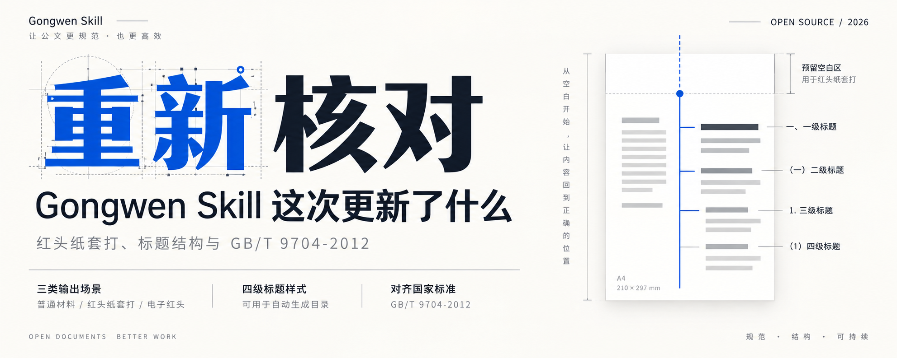
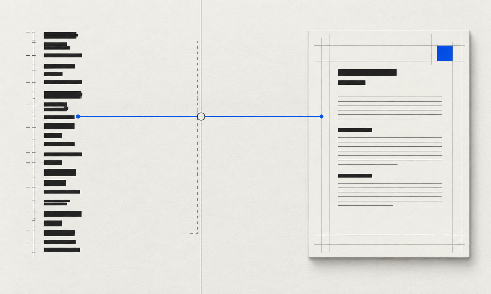
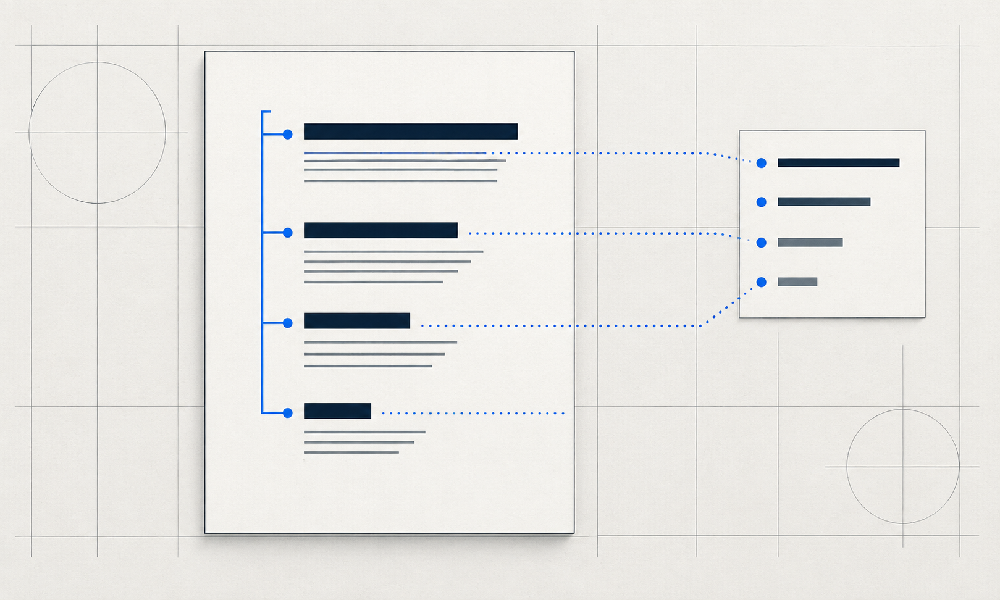

# 我把 Gongwen Skill 又审了一遍

这次更新不是原本计划里的功能扩充。

我前几天刚好用到了上一版的红头文件规则，才发现自己一直沿用的办法很笨，也很稳。我会先把正文排好，手动换行，在首页上方留出空白，再把纸放进带红头的打印机里。红头纸上已经印好了机关名称和红线，电脑只负责把本次需要的黑色内容打进去。

红头这一块，我此前没有做过实体打印测试。它在旧版里本来就该保持保守。

结果旧版 Skill 自己生成了电子机关抬头和红色分隔线。我回头看它的版式，位置和间距也没有完全按规范走。这个问题让我停下来重新检查了一遍。

我最担心的不是一个红线位置。公文格式看起来全是小项，天头、订口、版心、页码、文号、签发人、附件、版记、横排表格，还有信函、命令和纪要，各自都有条件。此前的核对很可能在上下文很长时漏掉了部分条款。我没有理由把这种遗漏包装成已经全面合规。

当时又正好赶上 GPT-6 Astra 发布前后。我在不同档位里遇到过明显的质量起伏，做上一版时也受过影响。这是我的使用观察，不足以说明任何模型的普遍状态。但它让我更愿意手动看文件、看规则、看最终页，而不是只看一段“校验通过”。

于是我把 GB/T 9704-2012 重新拉出来，逐项对照现有生成器、检查器和说明文档。漏掉的地方一项项补回去。

新版先把场景分开。普通报告、方案和汇报材料默认不画红头，即使内容里有单位名称。明确要制作正式发文时，才进入正式公文版式。红头默认按预印纸套打处理，首页预留区域，文档不重复画纸上已有的红色机关标志和红线。确实需要完整电子红头时，再显式开启。

另一个以前看上去没问题的缺口也补了。四级标题原先有字体和字号，却没有真正写进 Word 和 WPS 的标题样式。现在标题一到标题四都有样式和大纲级别。后续插目录、更新目录、跳转章节，文件终于能把自己的结构说清楚。

这次也重做了校验逻辑。它会根据普通材料、正式发文、信函、命令、纪要分别检查，不再拿一套机械条件去误判所有文档。TraeWork 的安装包也重新打包，里面没有留下之前的审查记录。

我已经验证了普通稿、预印红头纸套打稿和完整电子红头稿的 DOCX 结构与 PDF 渲染，也跑过了 Codex、Claude Code、OpenCode、Trae Code、Kimi、TraeWork、WorkBuddy、ZCode 的安装测试。

至于实体红头纸，我还是只说已经做到的部分。Skill 可以按纸样设置首页预留高度，真正套准还要在各单位的纸张和打印机上试一次。这不是推责，恰好是这类工具该保留的边界。

项目已经更新到 GitHub。若你拿它打印过红头纸，或者在 Word、WPS 里发现了目录、字体和分页问题，欢迎直接提 issue。这个 Skill 很小，对我却是实打实要用的东西。我想把它做成一个让人能放心继续改、继续打印的排版工具。

GitHub

https://github.com/mizzlelover/gongwen-gbt9704-skill
