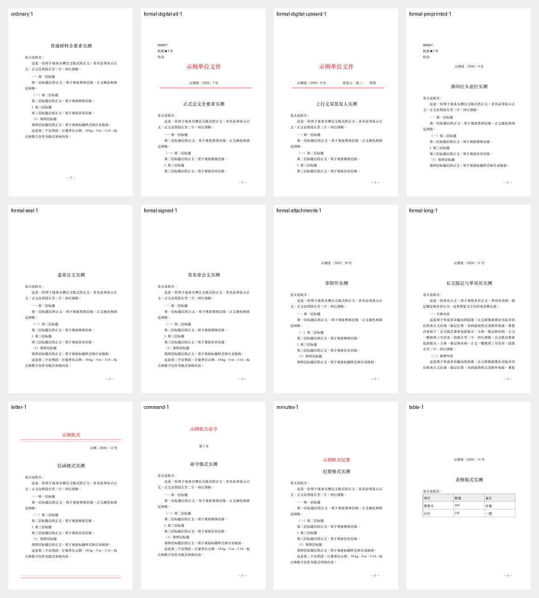
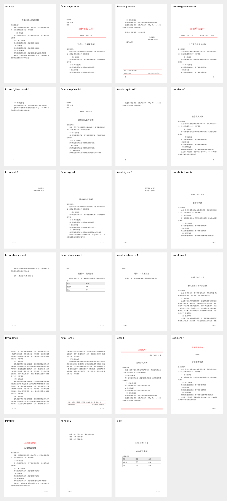
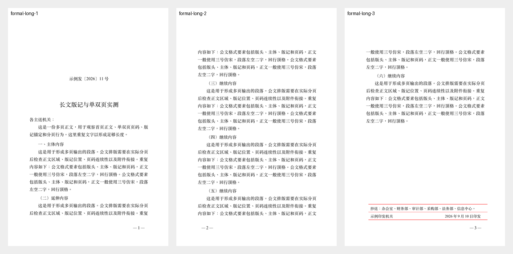

# GB/T 9704-2012 全条款视觉核验记录

本记录用于回答“生成的 DOCX 是否真的按标准版式呈现”，不是把 XML 中存在某个属性当成视觉合规证明。标准状态以[全国标准信息公共服务平台](https://std.samr.gov.cn/gb/search/gbDetailed?id=lOIe27f77QU%3D&mode=p)为准；该页面显示 GB/T 9704-2012 仍为现行标准，2025 年 5 月 30 日复审结论为继续有效。条文逐项对照了[标准全文转载页](https://dzb.cumtb.edu.cn/info/1040/1184.htm)。

## 核验方法

2026 年 9 月 10 日运行：

```bash
bash tests/visual-audit.sh /tmp/gongwen-visual-audit-latest
```

脚本实际生成 12 份 DOCX，逐份通过校验器，使用 LibreOffice 转 PDF，再用 `pdftoppm` 输出 23 张 PNG。人工检查以 PNG 为准，XML 和校验器只作为辅助证据。当前批次的文件清单保存在运行目录的 `manifest.tsv`，每份文件的校验日志保存在 `logs/`。







## 场景证据

| 场景 | 截图 | 实际观察 |
| --- | --- | --- |
| 普通材料 | `ordinary-1.png` | 有 A4 版心、正文和居中页码，没有机关标志或红线；仅提供机构名称不会自动变红头。 |
| 完整电子红头 | `formal-digital-all-1.png`、`formal-digital-all-2.png` | 份号、密级、紧急程度在左上；机关标志固定在版心上边缘下 35 mm 的首面位置；文号、红线、红线下两行空白、标题、主送机关和首页正文连续出现。字段不会再把机关标志向下推移。 |
| 上行文 | `formal-digital-upward-1.png` | 文号和签发人同一行，两个签发人可见；第二页页码移到左侧。 |
| 预印红头纸套打 | `formal-preprinted-1.png`、`formal-preprinted-2.png` | DOCX 不绘制红色机关标志和红线；左上黑色字段固定在首面，文号和标题从预留区域之后开始。红线必须由实际红头纸提供。 |
| 附件 | `formal-attachments-1.png`、`formal-attachments-3.png`、`formal-attachments-4.png` | 附件另页，第一行是“附件1/附件2”，第三行是标题，附件页码连续。 |
| 长文版记 | `formal-long-1.png`、`formal-long-2.png`、`formal-long-3.png` | 单页右、双页左页码连续；末页版记贴近版心底部，粗细线顺序可见。 |
| 盖章/签名章位置 | `formal-seal-2.png`、`formal-signed-2.png` | 文字落款和日期位置已生成；实体印章或签名章图片没有被伪造，需在 Word/WPS 或打印环节完成。 |
| 信函 | `letter-1.png` | 上粗下细双红线、文号、标题和页末上细下粗双红线可见；不显示页码。 |
| 命令（令） | `command-1.png` | 机关标志、令号下空二行、正文前再空二行可见。 |
| 纪要 | `minutes-1.png`、`minutes-2.png` | “出席/请假/列席”标签为黑体，人员为仿宋；人员标签左空二字，回行对齐。 |
| 横排表格 | `table-1.png` | 当前示例仍是纵向表格。这一张图是故意保留的缺口证据，不能把普通纵向表格宣称为标准横排表格。 |

## 条款逐项对照

状态含义：

- **截图通过**：本次生成并渲染后，已在 PNG 上看到对应版式结果。
- **结构通过，仍需人工**：DOCX 能写入或校验结构，但标准要求的纸张、模板、语义或目标软件行为不能由生成器单独证明。
- **当前未自动化**：工具不会冒充完成，必须使用机关模板或在 Word/WPS、打印环节处理。

| 条款 | 核对内容 | 本次结论 | 视觉证据或剩余动作 |
| --- | --- | --- | --- |
| 1 | 适用范围 | 结构通过，仍需人工 | `ordinary`、`formal`、`letter`、`command`、`minutes` 分开；文种和机关现行模板仍由使用者确认。 |
| 2 | 规范性引用文件 | 结构通过，仍需人工 | 摘要和清单列出 GB/T 148、GB 3100/3101/3102、GB/T 15834、GB/T 15835；正文单位、标点、数字仍需文本审校。 |
| 3 | 字、行术语 | 截图通过 | 3 号字、28 磅实现网格可在 `formal-digital-all-1.png`、`ordinary-1.png` 观察；特殊模板可以调整。 |
| 4 | 纸张技术指标 | 当前未自动化 | 克重 60—80 g/m²、白度、耐折度、不透明度、pH 属纸张采购和成品检测，DOCX/PDF 无法证明。 |
| 5.1 | A4 210 mm×297 mm | 截图通过 | 所有场景由 PDF 页面尺寸核对为 A4；仍需现场检查裁切误差。 |
| 5.2.1 | 天头 37 mm、订口 28 mm、版心 156 mm×225 mm | 结构通过，仍需人工 | 生成器写入固定页边距；打印缩放必须关闭并实测。 |
| 5.2.2 | 默认 3 号仿宋 | 结构通过，仍需人工 | 本机缺少标准仿宋，生成器已明确警告并使用 STFangsong 替代；`--require-standard-fonts` 会阻止输出。 |
| 5.2.3 | 一般 22 行、28 字 | 结构通过，仍需人工 | 28 磅网格和版心已写入；长标题、表格、字体替代造成的换行必须看最终 PDF/WPS。固定 28 磅不是把所有文稿都强行塞成 22 行的声明。 |
| 5.2.4 | 默认黑色 | 截图通过 | `ordinary-1.png` 和正文区域为黑色；红色仅出现在电子红头、信函和版记线。 |
| 6.1 | 制版清洁、字迹、尺寸和版心误差 | 当前未自动化 | 需检查实际印品，不从 PDF 颜色或 XML 推断。 |
| 6.2 | 双面印刷、套正、油墨和印品质量 | 当前未自动化 | `formal-long-2.png` 只证明双面页码方向的 PDF 模拟效果，不能替代双面打印和套正检查。 |
| 6.3 | 左侧装订、钉位、裁切、成品 | 当前未自动化 | 按 `references/formal-checklist.md` 在成品上检查。 |
| 7.1 | 版头、主体、版记三区和页码 | 截图通过 | `formal-digital-all-1.png`、`formal-long-3.png` 展示首面和末页三区关系。 |
| 7.2.1 | 份号六位、左上第一行 | 截图通过 | `formal-digital-all-1.png` 和 `formal-preprinted-1.png` 显示 `000007`；首面字段采用固定定位。 |
| 7.2.2 | 密级和保密期限第二行、3 号黑体 | 截图通过 | `formal-digital-all-1.png` 显示左上第二行；保密期限具体写法仍需机关确认。 |
| 7.2.3 | 紧急程度及顺序 | 截图通过 | `formal-digital-all-1.png` 显示份号、密级、紧急程度顺序；是否适用由发文机关决定。 |
| 7.2.4 | 机关标志居中、红色、距版心上边缘 35 mm | 截图通过 | `formal-digital-all-1.png` 以渲染坐标检查；左上字段不再推动机关标志。完整电子红头缺少小标宋时严格模式失败。联合行文标志仍需专用模板。 |
| 7.2.5 | 文号下空二行、年份、六角括号、序号规则 | 截图通过 | `formal-digital-all-1.png`、`formal-digital-upward-1.png`；输入验证拒绝“第”和前导零。 |
| 7.2.6 | 上行文签发人及多签发人 | 结构通过，仍需人工 | `formal-digital-upward-1.png` 已见同一行和两个签发人；超过两个签发人或联合行文转机关模板。 |
| 7.2.7 | 文号下 4 mm、版心等宽红线 | 截图通过 | `formal-digital-all-1.png` 红线与版心同宽；预印模式不重绘，改由纸样提供。 |
| 7.3.1 | 标题二号小标宋、红线下空二行、居中 | 截图通过 | `formal-digital-all-1.png`、`formal-preprinted-1.png`；本机缺小标宋时使用替代并报警，不能把替代字体称为标准字体。 |
| 7.3.2 | 主送机关标题下空一行、顶格、全角冒号 | 截图通过 | `formal-digital-all-1.png` 只出现一次“各主送机关：”，重复传入带冒号或不带冒号均归一化。 |
| 7.3.3 | 首页正文、三号仿宋、两字缩进、层次字体 | 截图通过 | `formal-digital-all-1.png` 和 `ordinary-1.png`；四级标题均有 Heading1—Heading4 和大纲级别。 |
| 7.3.4 | 附件说明 | 结构通过，仍需人工 | `--attachment-note` 统一冒号和末标点；长名称回行、复杂多附件需目标软件核对。 |
| 7.3.5 | 署名、日期、印章/签名章 | 结构通过，仍需人工 | `formal-seal-2.png`、`formal-signed-2.png`；日期校验已覆盖不补零，印章和签名章必须使用真实图片或实体章。联合行文人工处理。 |
| 7.3.6 | 附注 | 结构通过，仍需人工 | `--note` 生成全角圆括号并接在日期后；最终分页仍需抽检。 |
| 7.3.7 | 附件另面、标签、标题、版记前、页码连续 | 截图通过 | `formal-attachments-3.png`、`formal-attachments-4.png`；不能一起装订的附件需要补排发文字号和附件标识。 |
| 7.4.1 | 版记粗细线和末线位置 | 截图通过 | `formal-long-3.png` 显示粗—细—粗结构和末页底部锚定；极端分页仍需抽检。 |
| 7.4.2 | 抄送机关字号、缩进、句号 | 截图通过 | `formal-long-3.png`；多行和主送移版记仍需结合机关模板。 |
| 7.4.3 | 印发机关、日期、印发和细线 | 截图通过 | `formal-long-3.png`；实际名称过长时仍需在目标软件确认。 |
| 7.5 | 页码字号、单双页位置、7 mm、附件连续 | 截图通过 | `formal-long-2.png`、`formal-long-3.png`、`formal-attachments-4.png`；空白页及特殊版记例外需人工复核。 |
| 8 | 横排表格 | 当前未自动化 | `table-1.png` 明确显示当前生成器输出纵向表格；横排 A4 表格、表头方向和页码方向必须使用 Word/WPS 专用横向模板。 |
| 9 | 计量单位、标点、数字 | 结构通过，仍需人工 | 字段边界已校验；正文语义必须按引用标准审校。 |
| 10.1 | 信函格式 | 截图通过 | `letter-1.png` 显示 170 mm 上粗下细、下粗上细双线、文号、标题、无首页页码和无版记分隔线。 |
| 10.2 | 命令（令）格式 | 截图通过 | `command-1.png` 显示机关标志、令号下空二行和正文下空二行。签名章仍需人工。 |
| 10.3 | 纪要格式 | 截图通过 | `minutes-1.png`、`minutes-2.png`；机关标志 35 mm、人员标签字体和两字起排已观察。 |
| 11 | 标准式样图 | 结构通过，仍需人工 | 本记录使用标准条文和实际截图；最终发文仍须对照本单位现行式样图或授权模板。 |

## 发现并修正的实现问题

1. 版头字段曾以普通段落排列，份号、密级、紧急程度会把电子红头机关标志向下推移，预印红头套打的留白也会被挤开。现在这些字段改为首面固定定位，版心中保留等高占位；`formal-digital-all-1.png` 和 `formal-preprinted-1.png` 已重新观察。
2. 红线下标题曾只依赖段前距，部分渲染器会把标题贴在线上。现在红线或纸上红线之后写入两个显式 28 磅空段落；截图能看到标题与红线之间的实际距离。
3. 主送机关带不带末尾冒号时曾可能重复，现在归一化为一行全角冒号。
4. 纪要出席名单曾从版心左边缘开始，现改为左空二字并用悬挂缩进让回行对齐。

## 仍然不能由本工具单独保证的事项

- 本机没有方正小标宋和标准仿宋字体。生成器会报告替代字体；要交付标准字体稿，先安装字体并运行严格模式。
- 纸张克重、白度、印刷油墨、双面套正、左侧装订、裁切和盖章属于实体制作环节。
- 联合行文机关标志、多签发人复杂布局、不能与正文一起装订的附件、机关专用模板，以及横排表格没有被伪装成通用自动化功能。
- 正文内容的政策口径、单位、标点、数字和文种适用性仍需人工审校。
